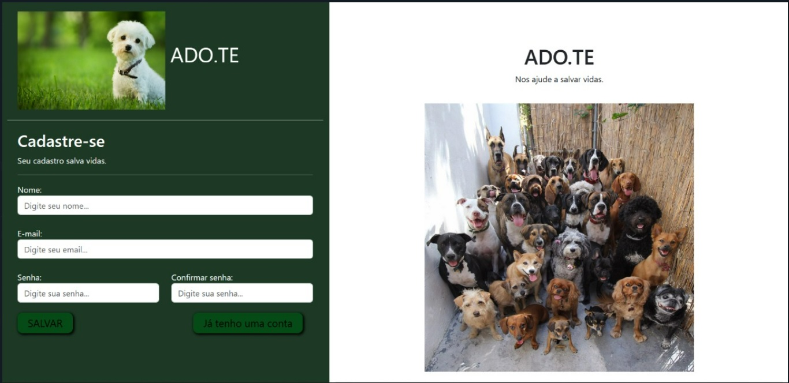

*Ola, seja bem vindo, 
Projeto PyStackWeek,
Aplicação Web com Python utilizando o Framework Django.
Cenário: Site para cadastro e Adoção de Pets;*

- Autenticação - Cadastro/Login
- filtragem de dados;
- URLs dinamicas;
- Arquivos de mídia;
- Criação/Busca de tabela no Banco de Dados - SqLite;

# Django + Python para Desenvolvimento WEB:

